# 🏪 基于 Flask 的地域美食推荐平台

# 获取方式---本文件是项目的部分文件，有需要可看【煮页】

# 联系🐧: 3660038549

<br>

🍽️ 场景聚焦：面向地域特色美食浏览、推荐、收藏、评论与商家入驻管理业务，覆盖用户找美食、商家维护菜品、管理员后台审核与统计的完整流程。

🤖 AI 赋能：接入 DeepSeek 对话能力，结合平台美食库，为用户提供自然语言美食问答、口味偏好分析和推荐理由说明。

📍 地域推荐：支持按地域、分类、评分、热度、价格等维度查询美食，帮助用户快速发现不同城市和菜系的特色美食。

⭐ 个性化体验：记录浏览、收藏、评分、评论等用户行为，提供个性化推荐、热门推荐、相似推荐、分类推荐、地域推荐、新品推荐等推荐能力。

🏪 商家入驻：普通用户可提交商家入驻申请，审核通过后进入商家中心，维护店铺信息、管理自家美食并回复用户评价。

📊 后台管控：管理员可统一管理用户、商家、美食、分类、评论、轮播图、公告和统计数据，满足平台日常运营维护需求。

#### 安装环境

Python 环境：建议 Python 3.10 及以上

Node.js 环境：建议 Node.js 18 或 Node.js 20

MySQL 数据库：建议 MySQL 8.0，需提前导入 `food_recommend.sql`

开发工具：PyCharm / VS Code / WebStorm 均可

浏览器：Chrome、Edge 等现代浏览器均可

#### 采用技术及功能

后端：Flask、Flask-SQLAlchemy、Flask-CORS、PyMySQL、python-dotenv、requests、scikit-learn

前端：Vue 3、Vite 5、TypeScript、Vue Router、Pinia、Element Plus、Axios、ECharts、Sass

数据库：MySQL，项目 SQL 脚本为 `food_recommend.sql`

平台前端：Vue 3(前端框架) + Vue Router(路由管理) + Pinia(状态管理) + Axios(请求工具) + Element Plus(UI 组件) + ECharts(图表) + Sass(样式预处理)

平台后端：Flask(核心框架) + SQLAlchemy(ORM) + RESTful API(接口风格) + PyMySQL(MySQL 驱动) + Flask-CORS(跨域支持) + DeepSeek API(AI 对话推荐)

开发环境：Windows10/Windows11、Python、Node.js、MySQL、VS Code/PyCharm/WebStorm

1、实现用户注册、登录、退出、个人信息维护、头像上传等基础功能；

2、实现普通用户、商家、管理员三类角色管理，不同角色登录后进入对应页面并拥有不同权限；

3、实现首页轮播图、公告展示、分类导航、热门美食和推荐美食展示；

4、实现美食列表查询，支持关键词、分类、地域、价格、评分、热度等信息浏览；

5、实现美食详情页，支持浏览量统计、评分展示、收藏操作、评论发布与评论列表查看；

6、实现用户收藏管理，用户可收藏喜欢的美食并在个人中心统一查看；

7、实现多维度推荐模块，包含个性化推荐、热门推荐、相似推荐、分类推荐、地域推荐、趋势推荐和新品推荐；

8、实现 AI 美食助手，用户可通过自然语言描述口味、预算、地域偏好，系统结合平台数据给出推荐建议；

9、实现商家入驻申请、商家资料维护、美食管理、经营统计和评论回复；

10、实现管理员后台，支持用户管理、商家审核、分类管理、美食管理、评论管理、公告管理、轮播图管理和数据统计。

#### 默认账号

[管理员]

账号：`admin`

密码：`admin123`

[普通用户]

账号：`zhangsan`

密码：`123456`

[商家用户]

账号：`merchant1`

密码：`123456`

> 说明：以上账号来自 `food_recommend.sql` 初始化数据，若自行修改 SQL 或数据库数据，请以实际数据为准。

#### 核心模块

| 模块 | 功能说明 |
|:---|:---|
| 用户管理 | 注册、登录、退出、个人资料维护、头像上传、角色权限控制 |
| 美食管理 | 美食新增、编辑、删除、上下架、图片维护、地域与分类维护 |
| 分类管理 | 分类新增、编辑、删除、排序、状态维护、图标/图片维护 |
| 评论互动 | 用户评论、评分统计、评论列表、评论删除、商家回复 |
| 收藏管理 | 收藏美食、取消收藏、收藏状态查询、我的收藏列表 |
| 推荐系统 | 个性化推荐、热门推荐、相似推荐、分类推荐、地域推荐、趋势推荐、新品推荐 |
| AI 助手 | DeepSeek 对话问答、口味偏好解析、平台美食匹配、推荐理由生成 |
| 商家中心 | 入驻申请、店铺资料维护、商家美食管理、评论回复、经营统计 |
| 内容运营 | 首页轮播图、平台公告、公告类型、启用禁用和展示排序维护 |
| 数据统计 | 用户数量、美食数量、商家数量、评论数量、浏览数据、评分数据等后台概览 |

#### 项目结构

```text
food-recommendation
├── backend/                         # Flask 后端服务
│   ├── app/
│   │   ├── models/                  # SQLAlchemy 数据模型
│   │   │   ├── announcement.py      # 公告模型
│   │   │   ├── banner.py            # 轮播图模型
│   │   │   ├── comment.py           # 评论模型
│   │   │   ├── favorite.py          # 收藏模型
│   │   │   ├── food.py              # 美食模型
│   │   │   ├── food_category.py     # 美食分类模型
│   │   │   ├── merchant.py          # 商家模型
│   │   │   ├── user.py              # 用户模型
│   │   │   └── user_behavior.py     # 用户行为模型
│   │   ├── routes/                  # API 路由模块
│   │   │   ├── admin.py             # 管理后台接口
│   │   │   ├── ai.py                # AI 对话接口
│   │   │   ├── announcement.py      # 公告接口
│   │   │   ├── banner.py            # 轮播图接口
│   │   │   ├── comment.py           # 评论接口
│   │   │   ├── favorite.py          # 收藏接口
│   │   │   ├── food.py              # 美食接口
│   │   │   ├── food_category.py     # 分类接口
│   │   │   ├── merchant.py          # 商家接口
│   │   │   ├── recommend.py         # 推荐接口
│   │   │   ├── upload.py            # 文件上传接口
│   │   │   └── user.py              # 用户接口
│   │   ├── services/                # 业务服务
│   │   ├── utils/                   # 响应封装、文件上传等工具
│   │   ├── config.py                # 应用配置
│   │   └── __init__.py              # Flask 应用工厂
│   ├── uploads/                     # 上传资源目录
│   ├── .env.example                 # 环境变量示例
│   ├── requirements.txt             # Python 依赖
│   └── run.py                       # 后端启动入口
├── frontend/                        # Vue 3 前端项目
│   ├── public/                      # 静态资源
│   ├── src/
│   │   ├── api/                     # Axios 接口封装
│   │   ├── assets/                  # 样式与资源文件
│   │   ├── components/              # 通用组件与业务组件
│   │   ├── router/                  # 路由配置
│   │   ├── stores/                  # Pinia 状态管理
│   │   ├── types/                   # TypeScript 类型定义
│   │   └── views/                   # 前台、商家端、管理端页面
│   ├── package.json                 # 前端依赖配置
│   └── vite.config.ts               # Vite 配置与代理配置
├── docs/                            # 项目文档与截图目录
├── food_recommend.sql               # 数据库结构与初始化数据
└── README.md                        # 项目说明
```

#### 项目截图

项目运行后可查看以下页面效果：

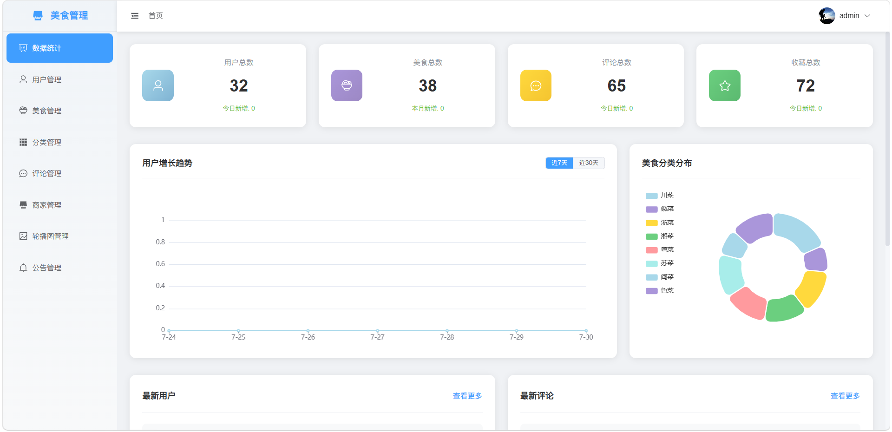
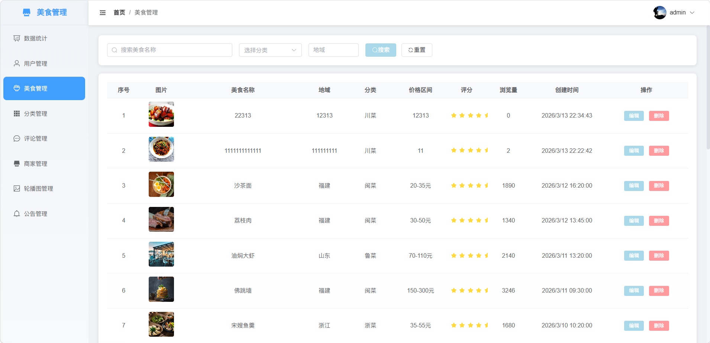
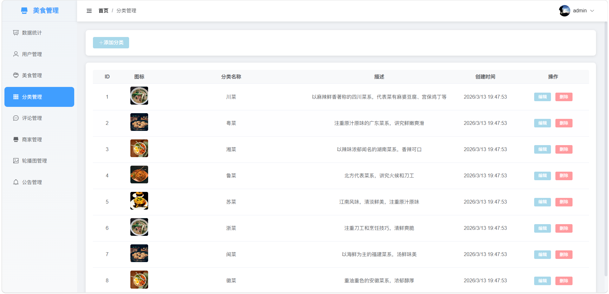
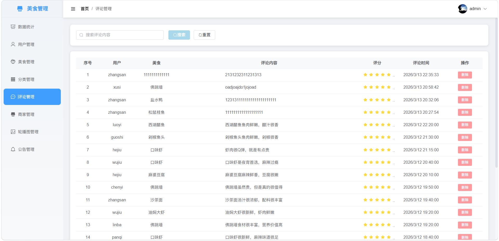
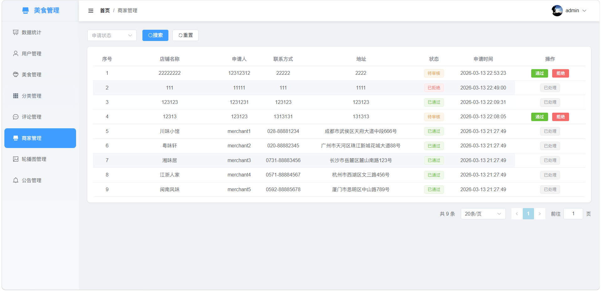
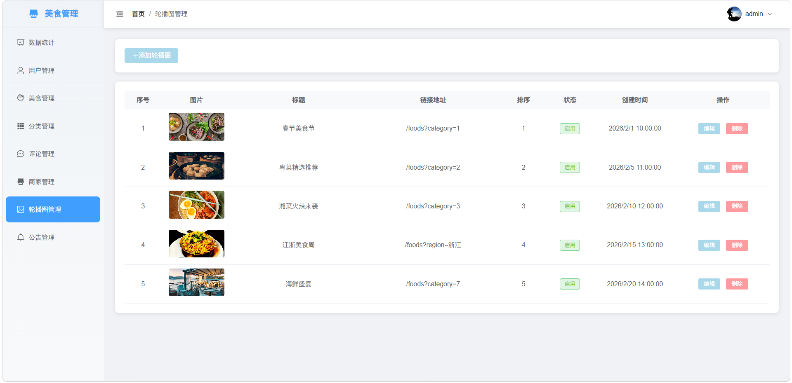
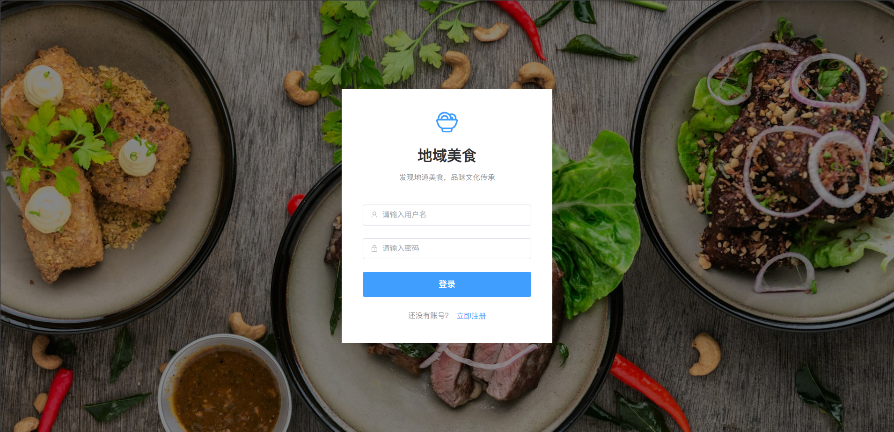
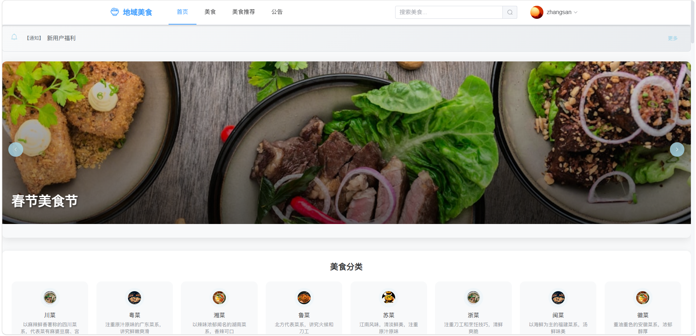
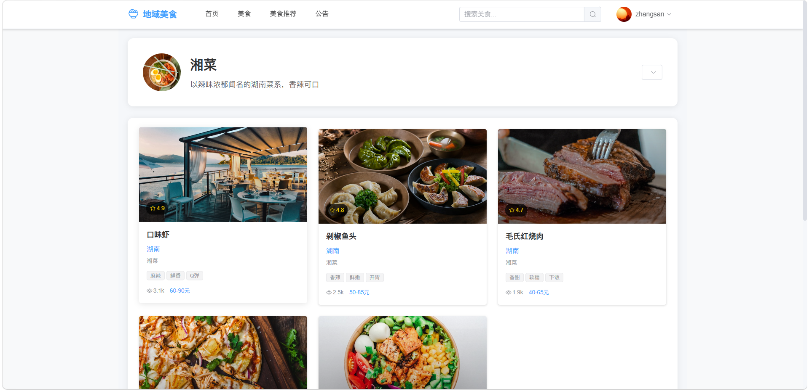
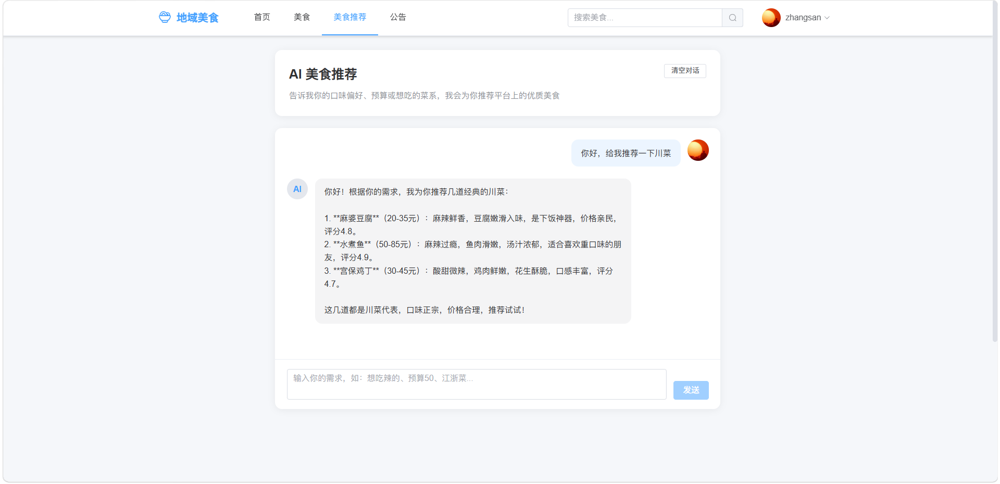
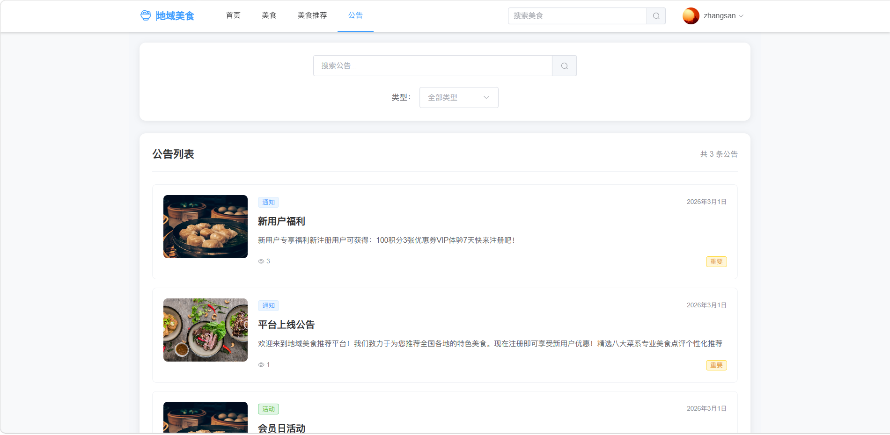

#### 常见问题

1、数据库连接失败：检查 MySQL 是否启动，确认 `backend/.env` 中 `DATABASE_URL` 的数据库名、账号、密码和端口是否正确。

2、SQL 导入后没有表：请确认先创建并选择了 `food_recommend` 数据库，再完整导入 `food_recommend.sql`。

3、后端依赖安装失败：建议先升级 `pip`，并确认 Python 版本为 3.10 及以上。

```bash
python -m pip install --upgrade pip
```

4、前端启动失败：请检查 Node.js 版本，建议使用 `Node.js 18` 或 `Node.js 20`，并重新执行 `npm install`。

5、前端接口请求失败：确认后端已启动在 `http://localhost:5000`，并检查 `frontend/vite.config.ts` 中 `/api` 代理配置。

6、图片上传或显示失败：请检查 `backend/uploads` 目录是否存在、是否具有读写权限，以及数据库中的图片路径是否正确。

7、AI 对话接口不可用：请确认 `backend/.env` 中 `DEEPSEEK_API_KEY` 已配置为有效 Key，并确保服务器可以访问 DeepSeek API。


